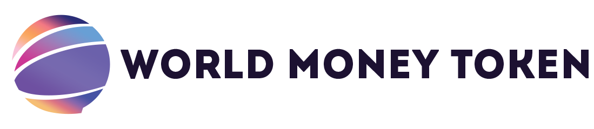

<!-- PROJECT LOGO -->
 

  

  <h3 align="center">World Money Token</h3>

  

    <a href="https://github.com/WorldMoneyToken/Token/blob/main/solidity/ERC-20.sol">Project Files</a>
    ·
    <a href="https://wmt.finance" target="_Blank">Website</a>
    ·
    <a href="https://github.com/WorldMoneyToken/Token/blob/main/docs/whitepaper.pdf">Whitepaper</a>
  

<!-- ABOUT THE PROJECT -->
## About WMT Project

**World Money Token (WMT)** is an ERC20 (BEP-20) token on the Binance Smart Chain (BSC) network meant to generate profit for its holders, at each transaction.

Each **World Money Token (WMT)** transaction is charged 5% as follows: 1% network development fee + 4% fee which is distributed to all World Money Token (WMT) holders. The more a person holds WMT Tokens, the more profit he generates, thus stimulating people to invest and hold this token.

**90%** of the funds raised from the initial DEX offering (IDO), initial Ape Offerings (IAO) and Initial Farm Offerings (IFO) will be blocked in the exchanges where the initial initial offering was made.

------------
Copyright © 2021 [WMT Smart Finance Solutions](https://wmt.finance)™. All rights reserved.

------------